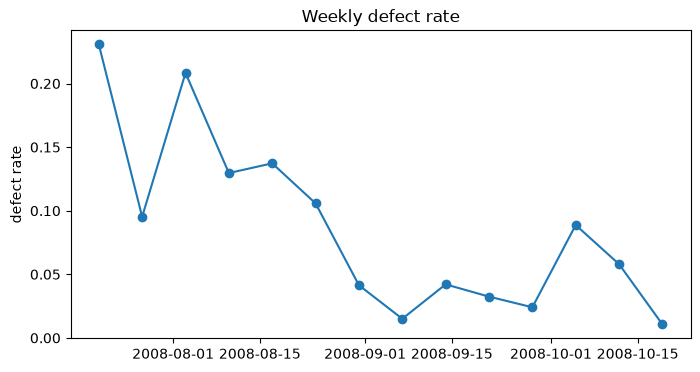
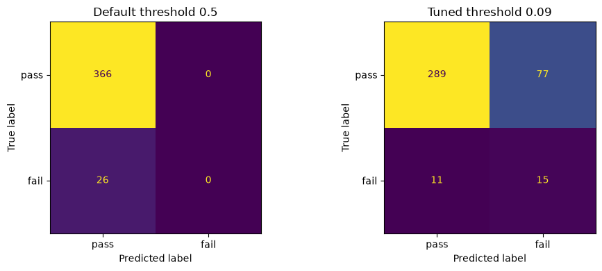
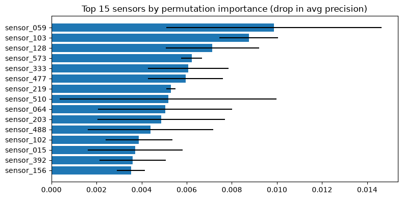

# Manufacturing Defect Prediction

Machine learning on real semiconductor manufacturing data (SECOM, UCI): predicting which parts will fail final quality testing based on ~590 process sensors, and finding the sensors most related to failures.

The full analysis with explanations is in [`notebooks/defect_prediction.ipynb`](notebooks/defect_prediction.ipynb).

## The problem

- 1567 parts, 590 anonymised sensor signals, pass/fail label and timestamp
- only 6.6% of parts are defective, so accuracy is meaningless (always predicting "pass" gives 93%)
- 4.5% of values missing, 28 sensors more than half empty, 116 sensors constant
- the defect rate changes over time: about 22% in July, about 3% in September



## Approach

- leakage-safe scikit-learn `Pipeline`: drop mostly empty sensors (custom transformer), median imputation, drop constant sensors, scaling
- model comparison with 5-fold `StratifiedKFold`: dummy baseline, logistic regression, random forest, gradient boosting, all with class weighting
- metrics for imbalanced data: ROC AUC, average precision, recall and precision for the defect class
- `GridSearchCV` for the random forest
- decision threshold chosen on out-of-fold predictions (target: catch at least 50% of defects), then applied once to the test set
- time-based validation: train on the past, test on the future
- unsupervised anomaly detection with `IsolationForest` trained on good parts only
- permutation importance to rank sensors

## Results (held-out test set, 392 parts, 26 defects)

| | Result |
|---|---|
| Random forest, ROC AUC | 0.778 |
| Random forest, average precision | 0.234 (random baseline: 0.066) |
| Defects caught at threshold 0.5 | 0 of 26 |
| Defects caught at tuned threshold | 15 of 26 (recall 0.58), precision 0.16 |
| IsolationForest, top 10% most unusual parts | 5 of 26 defects (random: ~2.6) |



**Random split vs time split (ROC AUC):**

| Model | Random split | Time split |
|---|---|---|
| Logistic regression | 0.674 | 0.672 |
| Random forest | 0.778 | 0.559 |

## Key takeaways

1. **The default 0.5 threshold hid a useful model.** The random forest ranked parts well but did not flag a single defect at 0.5. Choosing the threshold on training data based on the cost of a missed defect made it catch almost 60% of defects on unseen parts.
2. **Random split was too optimistic.** On future data the random forest dropped to near random, while simpler logistic regression stayed stable. The process drifted over time, so time-based validation and model monitoring matter more than squeezing out a slightly better score.
3. **The signal is weak.** Process sensors alone explain failures only partly, which is consistent with other published work on SECOM.



## Limitations and next steps

Few defects (104 total) means high variance in all metrics. Sensors are anonymised, so no domain knowledge could be used. Next steps would be feature selection, rolling-window retraining, monitoring prediction quality over time and reviewing the top sensors with process engineers.

## How to run

```bash
pip install -r requirements.txt
jupyter notebook notebooks/defect_prediction.ipynb
```

Runtime: a few minutes on a laptop (mostly the grid search and permutation importance).

## Data

SECOM dataset by M. McCann and A. Johnston, UCI Machine Learning Repository, licensed CC BY 4.0. https://archive.ics.uci.edu/dataset/179/secom. A copy is included in `data/`.
